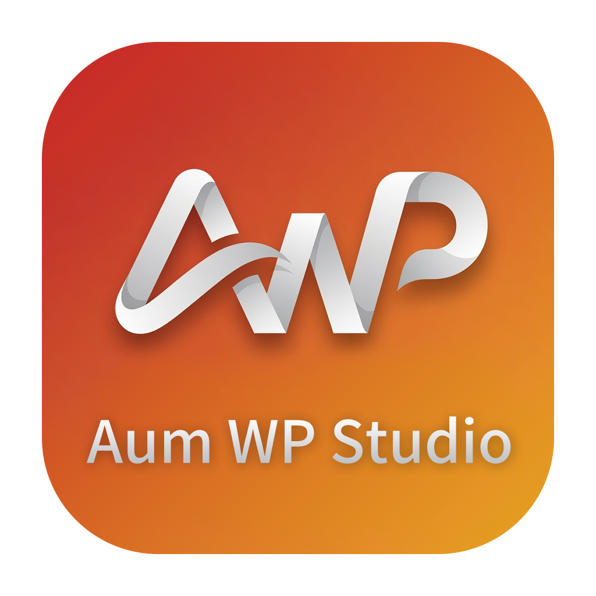

<div align="center">
  

  # AUM WP Studio

  <p><strong>A focused local WordPress workspace for people who build and ship themes.</strong></p>
  <p>为 WordPress 主题开发者打造的本地工作台：管理站点、复用主题、批量输出成品页面。</p>

  <p>
    <a href="https://github.com/aumcreate/wp-studio/releases/latest">Download</a>
    &nbsp;&nbsp;·&nbsp;&nbsp;
    <a href="https://app.aumcreate.cn">中文官网</a>
    &nbsp;&nbsp;·&nbsp;&nbsp;
    <a href="https://app.aumcreate.com">Website</a>
  </p>
</div>

---

> [!NOTE]
> **v0.2.0 is available now.** Select published pages or posts, choose a desktop width, and export complete PNG screenshots in one run. The capture engine scrolls through the rendered page so lazy content and entrance effects can finish before the final image is produced.

## English

### A local WordPress studio, not another disposable dev server

AUM WP Studio is a Windows desktop app for creating and managing local WordPress sites on `.test` domains. It is designed around the way theme builders actually work: maintain several sites, reuse a theme across them, review the finished pages, and ship visual deliverables without repetitive browser work.

Its foundation is the **Shared Theme Pool**. A theme lives once in a central directory and is linked into each selected site. Change the source theme once; every linked local site immediately reflects the change.

MariaDB, PHP, Caddy, and WP-CLI are managed by the app. A clean Windows machine does not need an existing PHP, MySQL, or web-server setup.

### Built for the full theme workflow

<table>
  <tr>
    <td width="50%" valign="top">
      
      <strong> Shared Theme Pool</strong><br />
      Store each parent theme once and link it into any number of local WordPress sites.
    </td>
    <td width="50%" valign="top">
      
      <strong> One-click site creation</strong><br />
      WP-CLI installs WordPress without sending you through a browser setup wizard.
    </td>
  </tr>
  <tr>
    <td width="50%" valign="top">
      
      <strong> Managed local stack</strong><br />
      MariaDB, PHP 7.4–8.5, Caddy, and WP-CLI are downloaded and managed on demand.
    </td>
    <td width="50%" valign="top">
      
      <strong> Native .test domains</strong><br />
      Hosts entries and Caddy virtual hosts are kept in sync automatically.
    </td>
  </tr>
  <tr>
    <td width="50%" valign="top">
      
      <strong> Full-page screenshots</strong><br />
      Batch-capture selected published pages or posts at a chosen desktop width.
    </td>
    <td width="50%" valign="top">
      
      <strong> Site tools included</strong><br />
      Open phpMyAdmin, the project folder, VS Code, or a WP-CLI-ready terminal directly from the site.
    </td>
  </tr>
  <tr>
    <td width="50%" valign="top">
      
      <strong> Translation-ready themes</strong><br />
      Export POT files for a theme or plugin without leaving the app.
    </td>
    <td width="50%" valign="top">
      
      <strong> In-app updates</strong><br />
      New Windows builds are delivered through GitHub Releases and installed from the app.
    </td>
  </tr>
</table>

### Full-page screenshot workflow

1. Start a local site and open its details panel.
2. Load its published pages or posts and select the items you need.
3. Choose 1920, 1440, 1280, 1024px, or a custom desktop width.
4. Export. Each result is saved as a PNG in a timestamped `screenshots` folder inside the site directory.

The capture process uses a real rendered browser window outside the visible desktop. It scrolls through the page before capture so viewport-triggered animation, lazy-loaded images, sticky headers, and normal theme layout have time to reach their final state. It does not override theme CSS to force a result.

### System requirements

- Windows 10 or Windows 11, 64-bit
- Administrator rights, required to manage the hosts file and bind port 80
- About 500 MB of free space for services downloaded on first launch

### Installation and Windows SmartScreen

The project is not code-signed. On the first installer run, Windows may show **“Windows protected your PC.”** This is expected for an unsigned release.

1. Download the installer from the [latest release](https://github.com/aumcreate/wp-studio/releases/latest).
2. Run `AUM-WP-Studio-Setup-x.y.z.exe`.
3. On the SmartScreen page, select **More info**, then **Run anyway**.

Subsequent in-app updates are downloaded and installed from WP Studio itself.

### Verify a download

Each release includes a SHA-256 value. In PowerShell:

```powershell
Get-FileHash ".\AUM-WP-Studio-Setup-x.y.z.exe" -Algorithm SHA256
```

Compare the result with the value in the release notes. If they differ, discard the file and download it again from the official release page.

---

## 中文

### 为主题交付而设计的本地 WordPress 工作台

AUM WP Studio 是一款 Windows 桌面应用，用于在 `.test` 域名下创建与管理本地 WordPress 站点。它不是又一个一次性的开发服务器，而是围绕主题开发与交付流程设计的工作台：同时维护多个站点、复用同一份主题、检查成品页面，再批量输出可交付的视觉素材。

核心能力是 **共享主题池**。主题只在中央目录保存一份，再链接到需要它的本地站点。修改源主题一次，所有关联站点都会立即同步。

MariaDB、PHP、Caddy 与 WP-CLI 均由应用按需下载和管理；干净的 Windows 电脑无需预先安装 PHP、MySQL 或 Web 服务器环境。

### 覆盖完整主题工作流

<table>
  <tr>
    <td width="50%" valign="top">
      
      <strong> 共享主题池</strong><br />
      每个父主题只保留一份，并可链接到任意数量的本地 WordPress 站点。
    </td>
    <td width="50%" valign="top">
      
      <strong> 一键创建站点</strong><br />
      通过 WP-CLI 完成安装，不再需要浏览器安装向导。
    </td>
  </tr>
  <tr>
    <td width="50%" valign="top">
      
      <strong> 托管本地服务</strong><br />
      按需下载并管理 MariaDB、PHP 7.4–8.5、Caddy 与 WP-CLI。
    </td>
    <td width="50%" valign="top">
      
      <strong> 原生 .test 域名</strong><br />
      自动维护 hosts 文件与 Caddy 虚拟主机配置。
    </td>
  </tr>
  <tr>
    <td width="50%" valign="top">
      
      <strong> 成品全页截图</strong><br />
      勾选已发布页面或文章，按所选桌面宽度批量输出整页 PNG。
    </td>
    <td width="50%" valign="top">
      
      <strong> 站点工具集成</strong><br />
      直接打开 phpMyAdmin、项目目录、VS Code 或已配置 WP-CLI 的终端。
    </td>
  </tr>
  <tr>
    <td width="50%" valign="top">
      
      <strong> 翻译文件导出</strong><br />
      无需离开应用即可为主题或插件导出 POT 文件。
    </td>
    <td width="50%" valign="top">
      
      <strong> 应用内更新</strong><br />
      新版 Windows 安装包通过 GitHub Releases 推送，并在应用中完成下载与安装。
    </td>
  </tr>
</table>

### 成品全页截图

1. 启动本地站点，打开站点详情面板。
2. 加载已发布页面或文章，并勾选要输出的内容。
3. 选择 1920、1440、1280、1024px，或自定义桌面宽度。
4. 点击截图。PNG 会保存到站点目录下带时间戳的 `screenshots` 文件夹。

截图过程会在屏幕外启动一个真实渲染的浏览器窗口，并完整滚动页面。因此进入视口动画、懒加载图片、粘性页头及主题原有布局都有足够时间到达最终状态。截图引擎不会通过改写主题 CSS 来强行显示内容。

### 系统要求

- Windows 10 或 Windows 11，64 位
- 管理员权限，用于管理 hosts 文件与绑定 80 端口
- 约 500 MB 可用空间，用于首次启动时下载内置服务

### 安装与 Windows SmartScreen

项目尚未进行代码签名，因此首次运行安装包时，Windows 可能显示 **“Windows 已保护你的电脑”。** 对于未签名发布包，这是正常提示。

1. 从[最新版本页面](https://github.com/aumcreate/wp-studio/releases/latest)下载安装包。
2. 运行 `AUM-WP-Studio-Setup-x.y.z.exe`。
3. 在 SmartScreen 页面点击 **更多信息**，再点击 **仍要运行**。

之后的应用内更新由 WP Studio 下载并安装，不需要重新经过这一流程。

### 验证下载文件

每个发布版本都会提供 SHA-256 校验值。在 PowerShell 中运行：

```powershell
Get-FileHash ".\AUM-WP-Studio-Setup-x.y.z.exe" -Algorithm SHA256
```

将结果与 Release 说明中的值对比；如不一致，请删除文件并从官方发布页重新下载。

---

## Development

```powershell
# Node.js 20 LTS required
npm install
.\node_modules\.bin\electron-rebuild -f -w better-sqlite3
npm run dev
```

### Release workflow

```powershell
$env:GH_TOKEN = "<GitHub token with repository Contents: write>"
npm run release
```

The command builds a draft GitHub Release and writes `dist-electron/checksums.txt`. Add the checksum and release notes, then publish the draft.

---

<div align="center">
  Built by <a href="https://app.aumcreate.com">AumCreate</a> · Free and open for theme builders.
</div>
